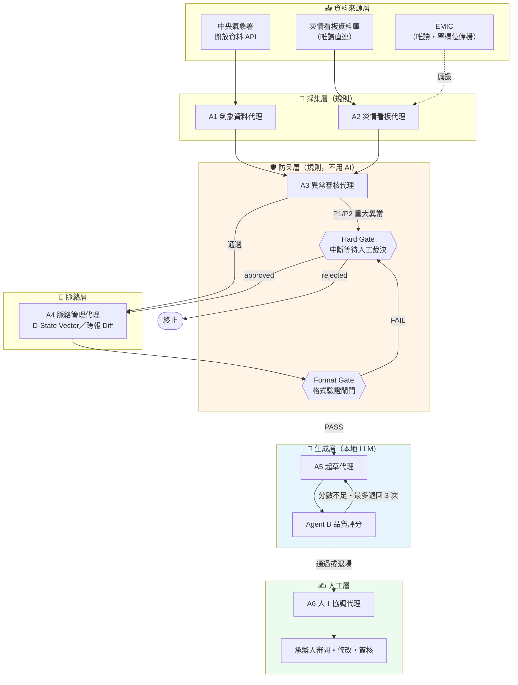

# 臺東縣消防局 EOC 災害處置報告自動化系統｜架構說明

以 **LangGraph 多代理（multi-agent）工作流** 自動產製「災害應變中心處置報告」草稿，
並在流程中內建**規則式防呆閘門**與**強制人工簽核**。

> 本 repo 是**架構說明文件**，不含實作程式碼。
> 原始碼位於機關內部私有儲存庫，涉及內部主機、資料庫結構與真實災情資料，不對外開放。
> 這裡公開的是**設計方法與取捨**——目的是讓其他機關要做類似自動化時，可以照著搬。

---

## 這是什麼／這不是什麼

| ✅ 本系統做的事 | ❌ 本系統不做的事 |
|---|---|
| 從災情看板資料庫、中央氣象署 API 取數，組成報告草稿 | 不自行產生任何數字（數字一律來自資料來源） |
| 對取得的資料跑規則式異常檢查，異常即攔停 | 不由 AI 判斷資料對錯 |
| 由 LLM 將結構化資料寫成通順敘述、並對草稿評分 | 不由 AI 決定報告是否發布 |
| 產出 Word 草稿供承辦人審閱修改 | **不自動對外發送**（無自動 LINE／Email 推播） |
| 唯讀取用中央災害應變資訊系統（EMIC）單一欄位作備援 | **不寫入 EMIC**，無 RPA 自動登打 |

**範圍**：颱風／水災之「災害應變中心處置報告」（一級開設每 3 小時一報、二級每 6 小時一報）。
**邊界**：最終簽核與對外發布由人執行，系統不介入。

---

## 系統總架構

**關鍵讀法**：橘色的防呆層**完全不使用 AI**。藍色的生成層即使整個失效，
橘色與綠色仍照常運作——系統會退回官方制式敘述並標示降級，報告不會停產。

---

## AI 到底用在哪裡

災害應變系統最常被問的問題是「AI 會不會亂編數字」。答案在這張表：

| 元件 | 使用技術 | 是否為生成式 AI |
|---|---|:---:|
| A1 氣象資料代理 | HTTP API 取數 + 結構驗證 | ❌ 純規則 |
| A2 災情看板代理 | 資料庫唯讀查詢 + 結構驗證 | ❌ 純規則 |
| A3 異常審核代理 | 規則比對、時序檢查、滑動視窗斜率監控 | ❌ 純規則 |
| Format Gate | 必填欄位與時間範圍驗證 | ❌ 純規則 |
| Hard Gate | 條件判斷 + 流程中斷 | ❌ 純規則 |
| A4 脈絡管理代理 | 句子嵌入模型（sentence-transformers） | ⚠️ 嵌入模型，非生成 |
| **A5 起草代理** | **本地 LLM 敘述生成** | ✅ **是** |
| **Agent B 評分** | **RAGAS + LLM-as-judge** | ✅ **是** |
| A6 人工協調代理 | 狀態機 + 決策套用 | ❌ 純規則 |

**九個元件中只有兩個使用生成式 AI**，且兩者都不接觸「數字要填多少」這件事——
數值由 A1／A2 直接自資料來源取得並帶著雜湊值一路傳遞，A5 只負責把它們寫成句子。

---

## 五個關鍵設計決策

**1. 安全檢查刻意不用 LLM**
異常偵測、格式驗證、跨報一致性比對全部寫成確定性規則。理由：災害應變場景需要
**可重現、可稽核、可解釋**的攔阻依據，LLM 的機率性輸出不符合這個要求。副作用是
LLM 服務中斷時，安全機制不受影響。

**2. 採用本地端 LLM 而非雲端 API**
災情資料含有民眾個資與尚未對外公開的處置資訊，不外送第三方服務。
代價是模型能力較弱，因此系統設計上**降低對 LLM 的依賴**（見上表）。

**3. 平行採集 + Reducer 合併，而非序列化**
A1／A2 自 `START` 平行 fan-out，透過 LangGraph 的 `Annotated[List, operator.add]`
reducer 累加寫入共享狀態，各代理只回傳自己新增的資料，不覆蓋他人結果。

**4. 雙時間戳的證據鏈**
每一筆證據同時記錄 `observation_time`（資料發生時間）與 `collection_time`
（系統取得時間），並附 SHA-256 雜湊。災害應變中「這個數字是幾點的」是致命問題，
單一時間戳無法回答。

**5. 先建立比對基準，才讓 AI 進場**
把 2016 年 9 月至 2025 年 11 月、17 個開設事件共 **239 份**歷年人工報告全數數位化，
作為「什麼叫正確」的定義。系統先證明能重現歷史報告，才討論生成品質。

---

## 驗證規模

| 項目 | 規模 | 說明 |
|---|---|---|
| 歷史報告比對基準 | **239 份**／17 事件 | 2016-09～2025-11，全數數位化 |
| 跨報一致性檢查 | **211 份**／16 事件 | 規則式全量掃描，不靠模型判讀 |
| 單事件全報次重製 | **35 報** | 核心欄位與比對基準未發現差異＊ |
| 資料來源覆蓋 | 41 張資料表中取用 **20 張** | 產報實際直接使用 |
| 自動化測試 | **1,134 項** | 2025-08-19 自行實測 |
| 異常回溯測試 | 6 事件／33 條真實異常 | 重大缺漏 0 漏接；12 次自動切備援全數產出可讀報告 |

> ＊「未發現差異」指**核心欄位**，非整份報告逐字相同；「100% 產出」亦不等於「100% 正確」。

---

## 文件導覽

| 文件 | 內容 |
|---|---|
| [`docs/01_architecture.md`](docs/01_architecture.md) | LangGraph 拓撲、共享狀態 schema、reducer 與 checkpoint 設計 |
| [`docs/02_agents.md`](docs/02_agents.md) | A1～A6、Agent B、兩道 Gate 的逐一規格與失效行為 |
| `docs/03_data_sources.md` | 三資料來源主從定位、降級策略、證據鏈（撰寫中） |
| `docs/04_safeguards.md` | 異常分類法、嚴重度分級、攔阻規則（撰寫中） |
| `docs/05_human_in_the_loop.md` | 人在迴路、中斷與續跑、決策帳本（撰寫中） |
| `docs/06_validation.md` | 比對基準建立方法、回溯測試設計（撰寫中） |
| `docs/07_design_decisions.md` | 架構決策紀錄（ADR）（撰寫中） |
| [`archive/2025-12_initial_concept.md`](archive/2025-12_initial_concept.md) | ⚠️ 2025-12 提案期構想，**已被取代**，僅供保存設計演進 |

---

## 技術堆疊

| 層 | 技術 |
|---|---|
| 工作流編排 | Python 3.10+ / LangGraph |
| 狀態持久化 | SQLite checkpointer（PostgreSQL 遷移方案已備） |
| LLM 推論 | 本地端 Ollama |
| 檢索與嵌入 | sentence-transformers |
| 品質評分 | RAGAS + LLM-as-judge |
| 前端 | Next.js |
| 報告輸出 | Word（.docx），套用機關既有範本 |

---

## 授權與聯絡

本文件由臺東縣消防局於「115 年資料創新暨技術應用輔導計畫」期間整理，
供各機關參考。文件中不含任何內部主機位址、資料庫結構、金鑰或真實災情資料。

臺東縣消防局　資通作業科 × 科技救災分隊
