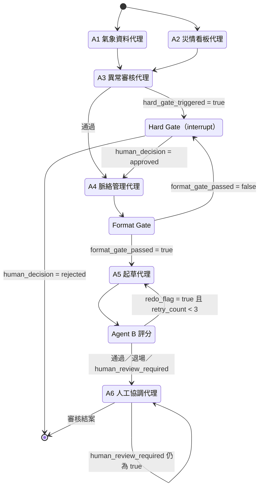

# 01 · 系統架構

> 本文件說明工作流拓撲、共享狀態設計與持久化機制。
> 各代理的個別規格見 [`02_agents.md`](02_agents.md)。

---

## 1. 為什麼是圖（Graph），不是管線（Pipeline）

處置報告的產製不是線性流程，它有三個特性讓單純的管線無法勝任：

1. **平行採集後匯聚** — 氣象與災情兩條資料線互不相依，應同時取數，但都必須到齊才能審核。
2. **中途需要人介入並續跑** — 偵測到重大異常時要停下來等人裁決，而非直接失敗。
   人裁決可能發生在數分鐘或數小時後，流程狀態必須能持久化並原地恢復。
3. **有條件迴圈** — 草稿品質不足要退回重寫，但需有次數上限與退場機制。

LangGraph 的 `StateGraph` 同時提供這三者：平行 fan-out 與 reducer 合併、
`interrupt()` 中斷點搭配 checkpointer、以及條件邊構成的受控迴圈。

---

## 2. 工作流拓撲

### 2.1 節點與邊



### 2.2 邊的類型

| 邊 | 類型 | 決策依據 |
|---|---|---|
| `START → A1`、`START → A2` | 靜態（平行 fan-out） | 無條件同時啟動 |
| `A1 → A3`、`A2 → A3` | 靜態（匯聚） | 兩者皆完成才進入 A3 |
| `A3 → {Hard Gate, A4}` | **條件邊** | `hard_gate_triggered` |
| `A4 → Format Gate` | 靜態 | — |
| `Format Gate → {A5, Hard Gate}` | **條件邊** | `format_gate_passed` |
| `A5 → Agent B` | 靜態 | — |
| `Agent B → {A5, A6}` | **條件邊** | `human_review_required` → `redo_flag` |
| `A6 → {A6, END}` | **條件邊（自迴圈）** | `human_review_required` |

### 2.3 Agent B 的路由優先序

路由函式的判斷順序有意義，不可調換：

```
1. human_review_required == True  → A6        （最高優先：已判定需人工，不再重寫）
2. scorecard.redo_flag == True    → A5        （退回重寫）
3. 其他                            → A6        （即使評分通過，仍須人工簽核）
```

第 3 條是刻意設計：**評分通過不等於可以發布**，所有路徑最終都會匯流到 A6，
不存在「系統自動結案」的路徑。

---

## 3. 共享狀態設計

所有節點讀寫同一個 `EOCState`（`TypedDict`）。這是 LangGraph 的鬆耦合模型：
代理之間不直接互相呼叫，只透過狀態溝通，因此可以獨立測試、獨立替換。

### 3.1 Reducer：平行寫入的關鍵

A1 與 A2 平行執行且都要寫入 `raw_evidence` 與 `active_errors`。
若使用預設的覆蓋語意，後完成者會洗掉先完成者的結果。解法是為這些欄位標註 reducer：

```python
class EOCState(TypedDict):
    # 累加型：各代理只回傳「自己新增的」，由 reducer 合併
    raw_evidence:   Annotated[List[EvidenceMetadata], operator.add]
    active_errors:  Annotated[List[ActiveError], operator.add]
    diff_log:       Annotated[List[DiffLogEntry], operator.add]

    # OR 型：任一代理觸發即維持 True，不會被後續節點覆蓋回 False
    hard_gate_triggered: Annotated[bool, _or_bool]
```

`hard_gate_triggered` 的 OR reducer 是安全機制：
**攔阻旗標只能由人工裁決解除，不能被任何下游節點意外清掉。**

### 3.2 狀態欄位分區

| 分區 | 主要欄位 | 寫入者 |
|---|---|---|
| 證據層 | `raw_evidence`、`evidence_chunks` | A1、A2、A4 |
| 異常層 | `active_errors`、`hard_gate_triggered` | A1、A2、A3、Format Gate |
| 脈絡層 | `d_state_vector`、`previous_d_state`、`diff_log`、`degradation_report` | A4 |
| 格式閘門 | `format_gate_passed`、`format_gate_failures`、`format_gate_verdict` | Format Gate |
| 草稿層 | `draft_report`、`retry_count`、`draft_verification` | A5 |
| 評分層 | `scorecard`、`frozen_rubric_hash`、`score_trajectory` | Agent B |
| 人工層 | `human_review_required`、`human_decision`、`human_modified_report` | A6 |
| 輸出層 | `final_report_internal`、`final_report_external`、`privacy_classification`、`report_time` | A6 |
| 執行中繼 | `run_id`、`trigger_type`、`report_seq`、`emergency_response_level` | 啟動時建立 |

### 3.3 證據中繼資料（EvidenceMetadata）

每一筆採集到的資料都包成標準結構，帶著身分與時間一路傳到報告：

| 欄位 | 說明 |
|---|---|
| `evidence_id` | 格式 `EVD-YYYYMMDD-{來源}-NNN`，A5 於正文內嵌此標記 |
| `source_type` | 來源分類（氣象 API／災情看板／Diff Log） |
| `source_path` | 原始端點或路徑 |
| `observation_time` | **資料發生時間 t_obs** |
| `collection_time` | **系統取得時間 t_col** |
| `sha256_hash` | 原始資料雜湊，供事後驗證未被竄改 |
| `data_valid_until` | 資料失效時刻，供降級判斷「這筆備份還能不能用」 |
| `content_summary` | 人類可讀摘要 |

**雙時間戳是刻意的**。`t_obs` 回答「這是幾點的雨量」，`t_col` 回答「我們幾點知道的」。
災害應變的爭議往往出在兩者的落差（資料延遲），只記其一無法追溯。

### 3.4 生成溯源

`draft_report` 除了正文，另記錄三個溯源欄位：

- `model_version` — 產出此草稿的模型識別碼
- `generation_version_id` — 此次生成的唯一識別（含 run_id 與重試序）
- `upstream_evidence_hash` — 起草當下上游證據的指紋

第三項用於偵測 **STALE（過期草稿）**：若人工審核期間上游資料已更新，
草稿指紋與當前證據不符，系統會標示此草稿已過期，避免簽核到舊資料寫成的報告。

---

## 4. 中斷與持久化

### 4.1 Hard Gate 是 interrupt，不是 exception

偵測到重大異常時，`hard_gate` 節點呼叫 LangGraph 的 `interrupt()`，
把當前狀態連同異常清單交給外部，流程**就地凍結**：

```python
human_decision = interrupt({
    "type": "hard_gate",
    "run_id": ...,
    "active_errors": [...],
    "message": "系統偵測到關鍵異常，請人工確認後輸入 approved 或 rejected。"
})
```

裁決 `approved` 時，除了續跑到 A4，同時把所有 `active_errors` 標記為 `resolved: true`
並將 `hard_gate_triggered` 復歸 —— **異常被人看過的事實會留在狀態裡，不是被抹除。**

### 4.2 Checkpointer

工作流編譯時掛載 SQLite checkpointer，每個節點執行後寫入狀態快照。因此：

- 人工裁決可以跨越數小時甚至跨日，中間允許程序重啟
- 每一步都可回溯查詢當時的狀態
- 續跑以 `thread_id` 定位，不需重跑已完成的節點

### 4.3 終端狀態保護

已進入 `completed` 或 `error` 的執行緒**拒絕再次續跑**。
這是防止重複簽核與重複產報的護欄——續跑請求會被回絕，而不是靜默地跑出第二份報告。

---

## 5. 降級（Degradation）設計

資料來源失效不應使產報中斷。系統採**分級延用**策略：欄位依重要性分層，
失效時依層級決定「延用上一報的值」或「標示為無資料」，並將整個降級決策寫入
`degradation_report`。此欄位同時作為可觀測指標的來源（降級啟動率、第二路徑成功率）。

原則：

- 降級一律**在報告上標示來源與資料時間**，不得靜默替換
- 降級事件同時寫入警報紀錄，提醒承辦人回源頭補正
- 最壞情況（全部來源失效）退回純人工登錄，產報不中斷

---

## 6. 與典型 RAG 系統的差異

熟悉 RAG 的讀者容易把本系統理解成「檢索後生成」，但關鍵差異在於：

| | 典型 RAG | 本系統 |
|---|---|---|
| 數值來源 | LLM 從檢索結果中「讀出」數字 | **數值由規則式代理直接取得並填入**，LLM 不負責取數 |
| 檢索目的 | 提供生成依據 | 提供**敘述脈絡**；數值另有結構化通道 |
| 失敗模式 | 幻覺（編造內容） | LLM 失效時退回制式敘述，**數值不受影響** |
| 品質把關 | 通常在輸出後由人抽查 | 生成**前**有格式閘門，生成**後**有評分，最後仍須人工簽核 |

這個切分是整套設計的核心：**把「數字對不對」交給規則，把「話順不順」交給 LLM。**
