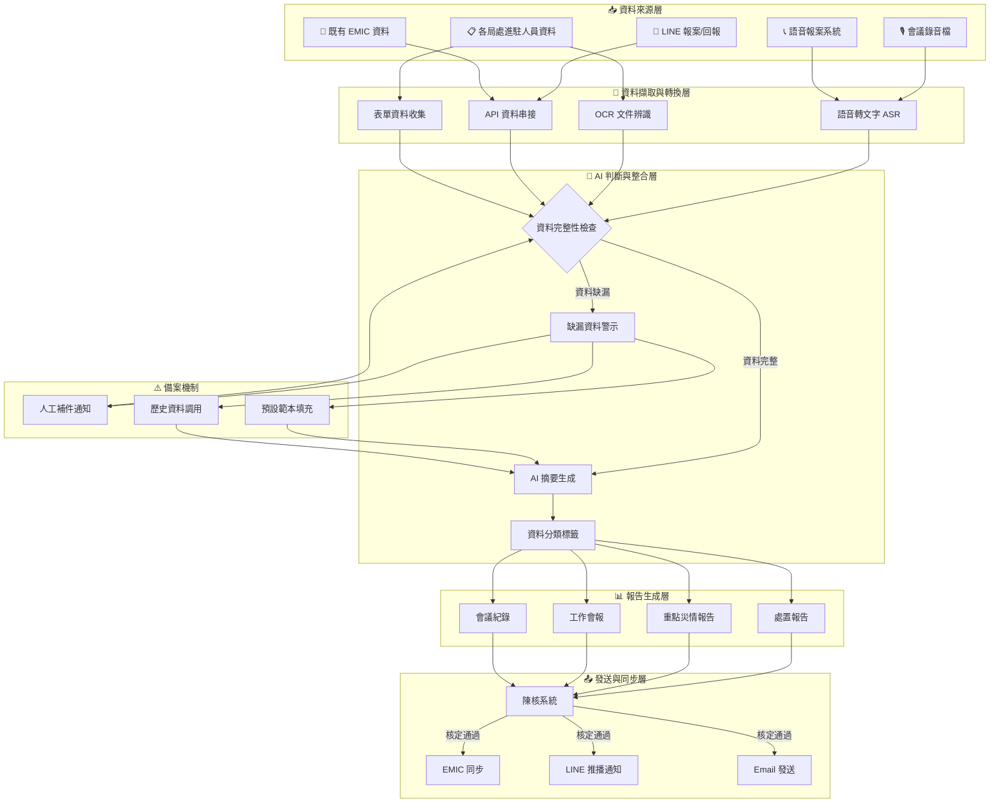
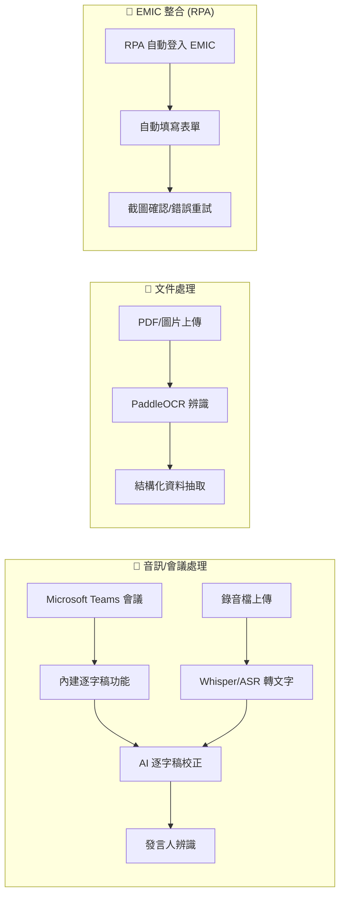
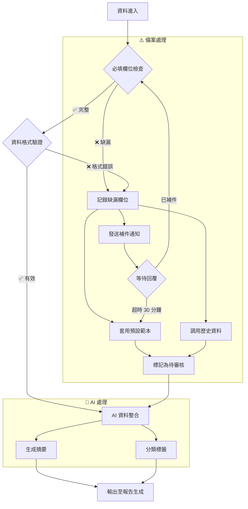
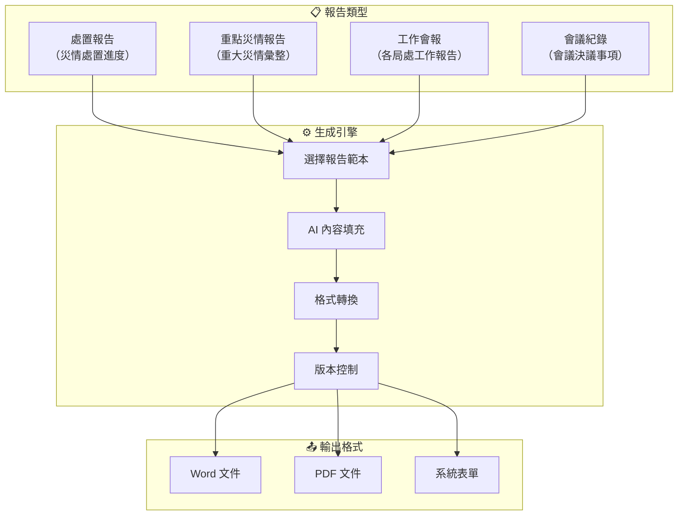
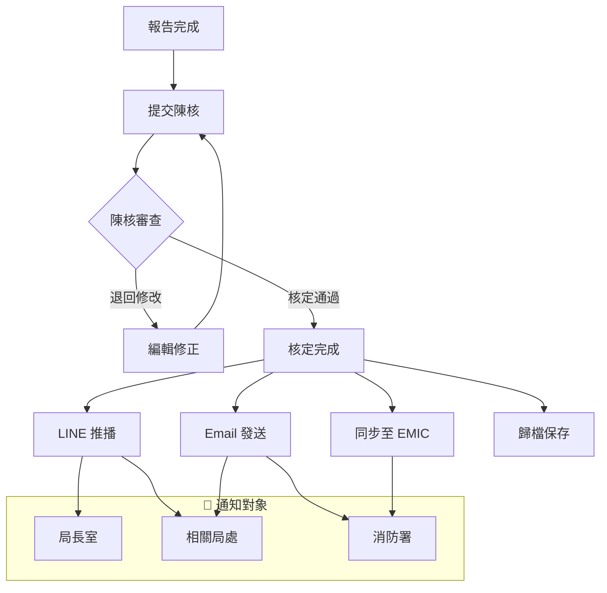

# 臺東縣消防局災害應變中心 (EOC) 自動化系統架構

## 系統背景

災害應變中心成立時，需將相關資料登打至 **EMIC 系統**。目前痛點：
- 會議記錄仍需人工聽錄音打成逐字稿
- 各局處資料需人工彙整
- 一級開設時需每 **3 小時** 出一報
- 報告需經陳核後再發佈

---

## 系統架構總覽

---

## 詳細流程說明

### 1️⃣ 資料擷取流程

### 2️⃣ 判斷邏輯（含備案機制）

### 3️⃣ 報告生成流程

### 4️⃣ 發送與同步流程

---

## 系統模組規劃（依優先級排序）

| 優先級 | 模組 | 功能 | 技術建議 |
|--------|------|------|----------|
| 🔴 1 | **報告自動彙整生成** | 各局處資料彙整並自動生成報告 | Python + AI (GPT-4/Claude) |
| 🟡 2 | **會議記錄自動化** | 會議轉逐字稿 + 摘要 | MS Teams 內建 / Whisper API |
| 🟢 3 | **EMIC 同步 (RPA)** | 自動登打 EMIC 系統 | Selenium / Playwright RPA |
| ⚪ 4 | 通知系統 | LINE / Email 推播 | LINE Bot / SMTP |

---

## 預期效益

1. **會議記錄自動化**：錄音轉文字 + AI 摘要，減少 80% 人工時間
2. **報告自動生成**：一級開設時每 3 小時自動出一報
3. **資料一致性**：自動同步至 EMIC，減少重複登打
4. **即時通知**：核定後自動推播至相關人員

---

## 下一步行動

### Phase 1：報告自動彙整生成 (最高優先)
1. 蒐集「處置報告」「重點災情報告」「工作會報」現有範本
2. 定義各局處需提供的資料欄位與格式
3. 建立 AI 報告生成 Prompt 與範本
4. 開發報告自動組裝系統 (Python)

### Phase 2：會議記錄自動化
1. 評估 Microsoft Teams 內建逐字稿功能
2. 若需離線方案，測試 Whisper API
3. 開發 AI 會議摘要模組

### Phase 3：EMIC 同步 (RPA)
1. 錄製 EMIC 操作流程
2. 使用 Selenium/Playwright 開發 RPA 腳本
3. 建立錯誤處理與重試機制
